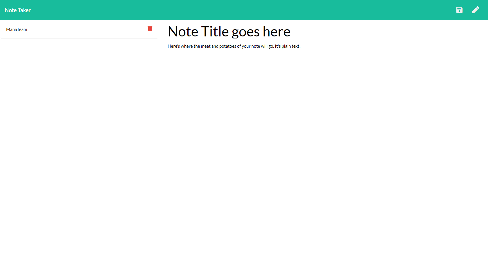

# Unit 11 Express Homework: Note Taker [](http://unlicense.org/) 

## Description
    This application can be used to take notes or as a todo list.


  
  ## Table of Contents
  1. [User Story](#UserStory)
  2. [Installation](#Installation)
  3. [Usage](#Usage)
  4. [Tests](#Tests)
  5. [Links](#Links)


  ## User Story
  ```
AS A user, I want to be able to write and save notes

I WANT to be able to delete notes I've written before

SO THAT I can organize my thoughts and keep track of tasks I need to complete
  ```

  ## Installation
  
    No installation necessary. App is live on Heroku.

  
  ## Usage

    The GUI is easy to use and responsive. 
    1. Click "Get Started." That will take you to the main page. 
    2. Click "Note Title" and input your note's title. Clicking "Note Text" will allow you to input the text of the note.
    3. There is an icon in the top left that will save the note to the sidebar.
    4. You can click the note on the sidebar to see it's contents at anytime.
    5. Clicking the pencil allows you to create a new note.
    6. Click the trash can next to the notes on the sidebar to delete the note.
  
  ## Tests
  
    npm tests. The application passes all the provided tests.
   
  ## Links
  
  [Git Hub Username](https://www.github.com/CodySamuels)
  
  [The Repo](https://github.com/CodySamuels/note-taker)

  [Deployed Link](https://radiant-crag-31130.herokuapp.com/)